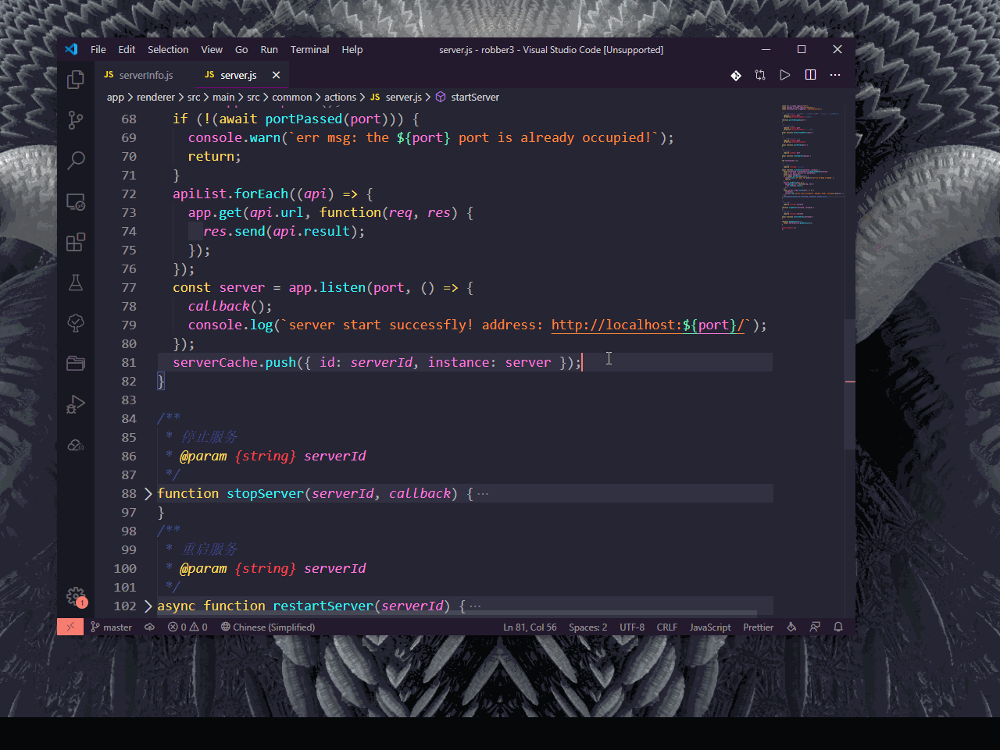

🎉

2.0.0 发布啦!
🥳

为了持续优化 VSCode 掘金的使用体验，欢迎加入 VSCode 掘金社区交流群。

考虑到微信群聊二维码存在过期时间，添加作者邀请入群，添加好友时请加备注「VSCode 掘金」。

# 📜 这是什么？

🎉 亲爱的掘友 ⛏️：

掘金是国内一个非常活跃的互联网技术人内容分享平台，其中聚集了非常多大牛创作者，为大家提供优质的内容，和大家一起分享成长。

遗憾的是，掘金不能在 VSCode 中使用。于是我开发了这款 VSCode 扩展。

在编码时，你只需要一个快捷键，就可以快速在 VSCode 中打开掘金，读文章或者刷沸点。

# 💡 功能亮点

- 可以边看文章边写代码，不用在 VSCode 和浏览器间频繁切换，提高工作体验和学习效率。
- 可以边写代码边刷沸点，光明正大地摸鱼。
- 可以隐藏文章和沸点的图片。
- 支持暗色主题，晚上再也不怕被刺瞎眼了！

# 🗺️ 如何使用？

## 沸点

默认快捷键 `ctrl + j + j`。（暂不支持，目前在规划中。）

## 文章

默认快捷键 `ctrl + p + p`。

如果快捷键不能正常使用，可以自行修改快捷键，或者采用如下方式：

windows 使用 `ctrl + shift + p` / macOS 使用 `command + shift + p` 唤出插件搜索框，搜索「掘金」。

# 📠 联系我

@掘友：如果您有新想法，[github 源码地址在这里](https://github.com/luzhenqian/vscode-juejin)，您完全可以自己动手实现任何想要的功能。

您也可以通过发邮件给 <15753140326@163.com> 与我联系，期待您的意见和建议。祝您摸鱼愉快。

<!--  -->

# 🔍 QA

## 🧐 为什么没有了禅模式？

因为 2.0.0 版本是完全重新设计，所以 0.x 版本的某些功能暂不支持，但未来的版本会支持，目前正在开发计划中。

## 🧐 为什么不支持登陆？

暂不支持，但未来的版本会支持，目前正在开发计划中。

---

## 🧐 为什么在 vscode 扩展商店搜索不到？

这个问题我不应该在这里回答，既然你都搜不到了，也很可能看不到这个答案。不过还有一种可能，也许你是从 github 看到的。

出现这个问题的原因八成是网络导致的，请尝试在 [vscode 扩展商店官网中安装](https://marketplace.visualstudio.com/items?itemName=luzhenqian.juejin)，如果你无法打开这个网页，那么几乎确定就是你的网络有问题。可以在社区群中求助。

---

## 🧐 我们提的新需求，你会做吗？

这个可能是大家比较关注的问题。

作者是一个积极拥抱开源的人，非常注重用户体验。所以如果你有新的想法，或者在使用过程中遇到困扰你的地方，欢迎提出来。只要你的需求是合理的，那我会考虑帮你实现。

---

# 🐛 已知但尚未修复的 BUG

- 暂无

<!-- ## 待修复 BUG -->

<!-- TODO: 2. 各个区域颜色可配置 -->
<!-- TODO: 3. 评论区图片不显示 -->
<!-- TODO: 9. 在下方消息栏或右上角设置快速打开/关闭按钮 -->
<!-- TODO: 10. 当为第 1 页和最后 1 页时，按钮禁用 -->
<!-- TODO: 11. 可配置最大页数 -->
<!-- TODO: 12. 翻页后状态失效 -->
<!-- TODO: 13. 翻页时会产生undefined页面 -->
<!-- TODO: 14. 点击下一页和上一页时加 1s 防抖 -->
<!-- TODO: 16. 评论条数并不会完全显示，这个BUG是掘金接口数据导致的，暂时不做修改。-->
<!-- TODO: 18. 文章搜索 -->
<!-- TODO: 19. 文章列表刷新 -->
<!-- TODO: 20. 文章阅读模式 （原版/简洁版） -->

# 🌌 支持 VSCode 版本

支持 VSCode 1.43.0+ 版本，低版本的掘友请自行升级。

# 🏷️ 版本历史

<!-- Added 新功能。
Changed 用于更改现有功能。
Deprecated 即将删除的功能。
Removed 现在已删除的功能。
Fixed 对于任何错误修复。
Security 以防万一。 -->

### 2.0.2 2022 年 8 月 12 日

- 支持禅模式。

---

### 2.0.1 2022 年 8 月 12 日

- 废弃版本。

---
### 2.0.0 2022 年 8 月 12 日

- 对文章模块的 UI、交互与功能进行重新设计。

---

<h3 style="color: rgb(220 38 38);">由于掘金 API 升级，以下版本均不可用</h3>

---

### 0.2.22 2020 年 8 月 3 日

1. 掘金升级，接口和数据结构发生改变，修复文章阅读功能。

---

### 0.2.21 2020 年 7 月 31 日

1. 掘金升级，接口和数据结构发生改变，修复沸点及评论功能。

---

### 0.2.2 2020 年 7 月 23 日

1. 添加文章分类。

2. 添加文章默认分类可配置功能。

---

### 0.2.1 2020 年 4 月 15 日

1. 添加文章加载时的遮罩。

---

### 0.2.0 2020 年 4 月 13 日

1. 添加文章功能。

2. 修复沸点切换页面时滚动条仍然在原位置的 BUG。

---

### 0.1.4 2020 年 3 月 21 日

1. 优化操作区 UI。

2. 修复偶尔翻页时会出现的 undefined 页面的 BUG。 _（该变动后将不再进行页面缓存，会提高内存性能，但会降低渲染下一页时的性能。）_

3. 修复显示图片和极简模式的状态错乱的 BUG。

4. 修复开启极简模式后，评论区头像不隐藏的 BUG。

5. 修复回到上一页后图片无法正常缩放的 BUG。

6. 修复同时打开多个评论面板时，无法正常收起评论面板的 BUG。

7. 添加沸点 icon。

8. 添加当前页数显示。

9. 最大页数调整为 5 页。

---

### 0.1.3 2020 年 3 月 20 日

1. 添加评论区回复的目标用户名高亮效果。

2. 沸点的评论为 0 条时不显示展开评论。

3. 修复沸点和评论内容不换行的 BUG。

4. 添加极简模式，可以隐藏头像。

5. 添加顶部文字定制功能。

6. 添加评论区域颜色定制功能。（暂时的解决方案，随时会用更加优雅的方式替换）

7. 添加默认快捷键 ctrl + j + j。

---

### 0.1.2 2020 年 3 月 19 日

1. v0.1.1 版本发布时出现失误，导致代码未能正确更新，BUG 未能正常修复，重新发布。

---

### 0.1.1 2020 年 3 月 19 日

1. 修复评论显示问题。

---

### 0.1.0 2020 年 3 月 18 日

1. 初始版本，基础功能。

---
